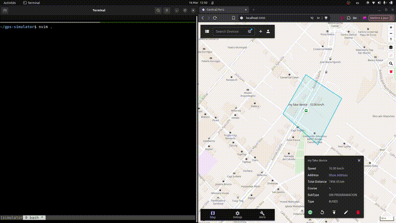

# GPS Simulator — Teltonika / Traccar

A lightweight C simulator that mimics a real Teltonika GPS tracker communicating over a raw TCP connection. Built for testing and validating fleet management backends compatible with the [Traccar](https://www.traccar.org/) platform.



---

## Overview

This simulator establishes a persistent TCP connection to a Traccar server and exchanges binary packets following the **Teltonika Codec 8** protocol — the same protocol used by real Teltonika FMB/FMC hardware devices. It is designed to let you test alert rules, geofence triggers, stop detection, and overspeed events without needing physical hardware.

---

## Protocol

Communication follows the **Teltonika Codec 8** binary protocol over TCP:

- **IMEI handshake** — the simulator identifies itself with a 15-digit IMEI before sending any data
- **AVL data packets** — each packet contains a GPS record with timestamp, coordinates, altitude, speed, heading, satellite count, and I/O data
- **CRC16 validation** — every packet is signed with a Teltonika CRC16 checksum
- **Server ACK** — the server responds with the number of records received; the simulator validates this before proceeding

---

## Features

- Real-time TCP connection to a Traccar server (IPv6 supported)
- IMEI registration and server acknowledgement handling
- Route simulation along a sequence of GPS coordinates
- Dynamic speed calculation based on distance between waypoints
- Stop event simulation for geofence-based stop alert testing
- CRC16 computation matching the Teltonika specification

---

## Requirements

- GCC or Clang
- A running Traccar instance with the Teltonika protocol enabled on port `5027`
- Linux or macOS

---

## Configuration

Edit the defines at the top of `main.c`:

```c
#define SERVER_IP   "::1"      // Traccar server IP (IPv6)
#define SERVER_PORT 5027       // Teltonika protocol port
```

The IMEI can be changed in `main()`:

```c
char imei[] = "123456789012345";
```

Make sure this IMEI is registered as a device in your Traccar instance.

---

## Build & Run

```bash
chmod +x ./build.sh  
./main
```


Tested against **Traccar 5.x** with the Teltonika protocol handler. The packet format follows the official [Teltonika Codec 8 documentation](https://wiki.teltonika-gps.com/view/Codec#Codec_8).
